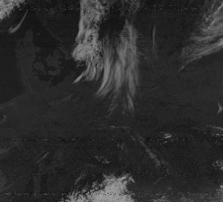
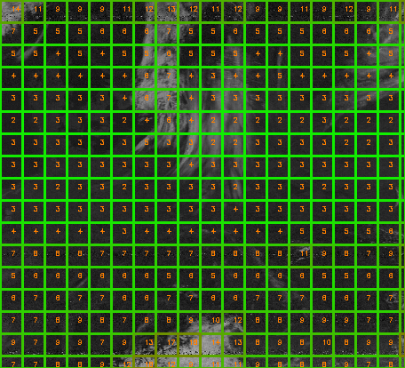
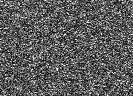
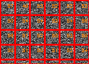
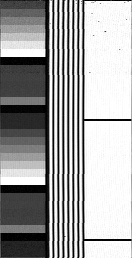
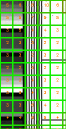
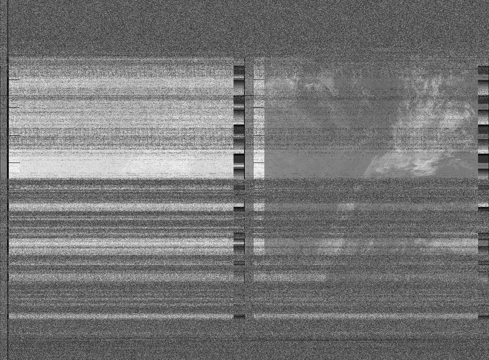
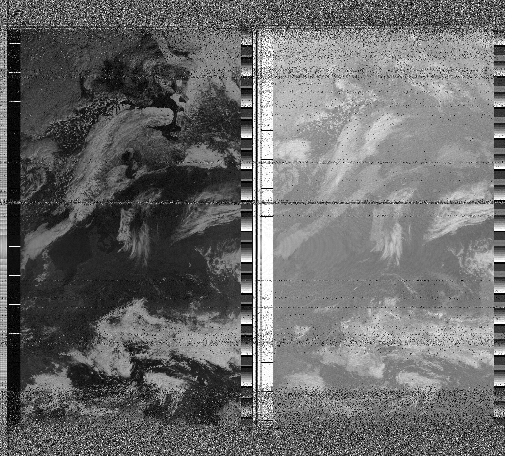
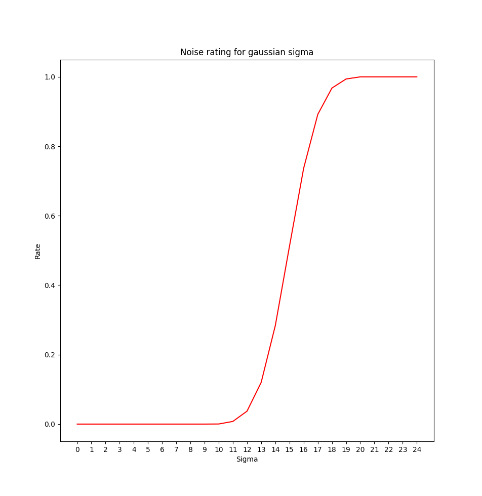

# Analog noise estimation

Module for estimate analog noise on the images.

Contains implementation of paper:
J. Immerkær, “Fast Noise Variance Estimation”, Computer Vision and Image
Understanding, Vol. 64, No. 2, pp. 300-302, Sep. 1996

You can estimate noise in whole image (as in original idea) or estimate noise
in small boxes  and next merge estimations into single result using provided
rating functions.

# Results

Used Laplacian 3x3 kernel and Numpy implementation of convolve, box 25x25 pixels.

Sigma is normal distribution sigma parameter.  
In "average local sigma clip" sigma is clip on value 30.

Metrics present noisy part of image. 

"Global sigma" is calculated from whole image without splitting into boxes.  
"Global rating" present noisy part of image, but it is calculated from global sigma.

### Good square

Global sigma: 4.630285306260067  
Average local sigma: 5.779785867841117  
Average local sigma clip: 5.779785867841117  
Global rating: 0  
Constant metric: 0.04643962848297214  
Linear metric: 0.02700538949831164  
**Gauss metric: 0.019763315201960927**  

 

### Noise square

Global sigma: 46.1618466613965  
Average local sigma: 56.172134778404356  
Average local sigma clip: 30.0  
Global rating: 1  
Constant metric: 1.0  
Linear metric: 1.0  
**Gauss metric: 1.0**  

 

### NOAA control area

Global sigma: 3.0373033731974606  
Average local sigma: 4.357952733368098  
Average local sigma clip: 4.357952733368098  
Global rating: 0  
Constant metric: 0.022727272727272728  
Linear metric: 0.010603128772758869  
**Gauss metric: 0.012523404874079712**  

 

### APT - bad quality

Global sigma: 42.14491795131236  
Average local sigma: 50.41452993959203  
Average local sigma clip: 29.175048508970093  
Global rating: 1  
Constant metric: 0.9773425499231951  
Linear metric: 0.9762678452411343  
**Gauss metric: 0.9758709874331352**  

 

### APT - medium quality

Global sigma: 17.020939720120662  
Average local sigma: 21.43077214287576  
Average local sigma clip: 15.831956487119431  
Global rating: 0.8918800746691967  
Constant metric: 0.45802005012531327  
Linear metric: 0.430505130732554  
**Gauss metric: 0.4216867574113292**  

 

# How to use

1. Install Python dependencies

```
pip install -r requirements.txt
```

2. Run command line interface

```
python cli.py
```

3. Import in your code (quick path)

```python
import cv2
import noise_estimator

img = cv2.imread("data/product1.png", cv2.IMREAD_GRAYSCALE)

noise = noise_estimator.estimate(img)

print("Noisy / all", noise)
```

4. Look at the [cli.py](./cli.py) code for more complex usage example

# Gauss rating

This package contains function for rate noise. It returns 0 for good quality image and 1 for noisy. Rating is based on detected sigma value.

We assume that sigma less then 10 means clear image (rate 0). Different sensors may to produce different average sigma. But empirical analysis has shown that good quality images have sigma 10 or less.

Sigma greater then 20 means that image is bad (rate 1).

Values between 10 and 20 are problematic. 11-12 are quite code, 17-19 are quite bad, 13-16 are medium, but the relationship does not seem to be linear. We use cumulative (normalized) normal distribution function for determining this value.

Below shown plot with metric values for different sigma.



# References

J. Immerkær, “Fast Noise Variance Estimation”, Computer Vision and Image Understanding, Vol. 64, No. 2, pp. 300-302, Sep. 1996
